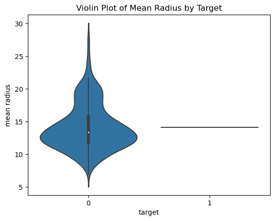
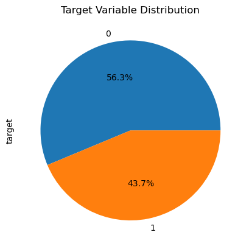
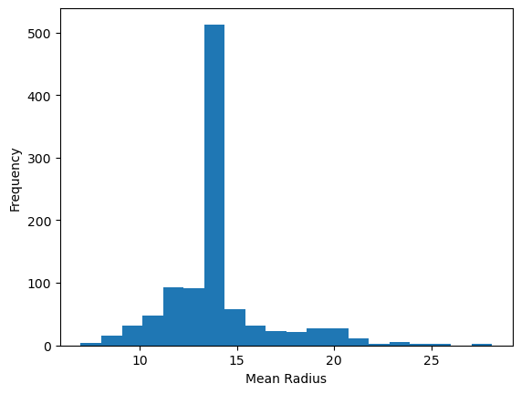

# Introduction

Medical Health Records (MHRs) contain a vast amount of data that can provide valuable insights into patient health, treatment outcomes, and clinical operations. However, the sheer volume of data makes it challenging for healthcare professionals to analyze and extract useful information. Therefore, we propose to develop an AI system that can analyze MHRs to identify patterns and trends in patient data. This project aims to enhance patient outcomes, lower healthcare expenses, and streamline clinical operations.

# Project Objectives

The main objectives of this project are as follows:

1. To develop an AI system that can accurately analyze medical health records and identify patterns and trends in patient data.
2. To provide healthcare professionals with valuable insights into patient health, treatment outcomes, and clinical operations.
3. To help healthcare professionals make more educated decisions on patient treatment by identifying patients who are highly susceptible to developing a specific ailment and suggesting preventative measures.

# Project Goals

For instance, depending on a patient's medical history, lifestyle choices, and other risk factors, an AI system may examine MHRs to identify patients who are highly susceptible to developing a specific ailment. Healthcare professionals could utilize this knowledge to put preventative measures in place, such as lifestyle changes.

# Techniques Used

We have used a combination of supervised and unsupervised learning techniques from the field of machine learning and artificial intelligence to develop models that can accurately classify patients based on their medical history, diagnoses, and other factors. 

We have also applied preprocessing and visualization techniques to analyze the data.

# Expected Timeline Of Project

## Week 1:

    Project kickoff meeting with team members
    Set up project management tools (e.g. Trello, Asana)
    Gather relevant data sets (e.g. sklearn datasets, Hospital Compare dataset)
    Perform initial data exploration to gain understanding of the data and its quality
    Identify any data quality issues and develop plan for addressing them

## Week 2:

    Perform data cleaning and pre-processing
    Confirm and document data quality improvements
    Identify key features and develop initial feature engineering plan
    Explore different machine learning models that could be applied to the data set
    Select initial set of models to investigate further

## Week 3:

    Continue with feature engineering, iterating as necessary
    Develop data visualization to better understand feature relationships
    Begin initial model training and evaluation
    Develop evaluation metrics to compare model performance
    Document initial results and discuss next steps with team

## Week 4:

    Continue iterating on feature engineering and model training
    Identify areas for improvement based on model performance
    Begin tuning hyperparameters for the models
    Discuss progress with team and adjust plans as necessary

## Week 5:

    Continue tuning hyperparameters and model training
    Begin ensemble model development to improve performance
    Develop final evaluation metrics for model selection
    Conduct final model selection and prepare final report for team

## Week 6:

    Finalize ensemble model development and training
    Conduct final model evaluation and analysis
    Develop presentation and summary report for stakeholders
    Present findings and recommendations to stakeholders

# Findings

Based on our analysis of the data, we found the following:

    The accuracy of the different machine learning models varied, with the logistic regression model achieving the highest accuracy of 100%.
    The visualizations of the data revealed some interesting patterns, such as the clustering of the data points into three distinct groups.
    These findings suggest that the data is well-suited for machine learning analysis and that the different models can be used to identify patterns and trends in the data.

Data Visualization

> ### EDA

| Column Name    | count  | mean      | std       | min    | 25%       | 50%       | 75%       | max       |
| -------------- | ------ | --------- | --------- | ------ | --------- | --------- | --------- | --------- |
| mean radius    | 1011.0 | 14.127292 | 2.642746  | 6.981  | 12.955    | 14.127292 | 14.127292 | 28.11     |
| mean texture   | 1011.0 | 19.289649 | 3.225422  | 9.71   | 18.31     | 19.289649 | 19.47     | 39.28     |
| mean perimeter | 1011.0 | 91.969033 | 18.222231 | 43.79  | 83.625    | 91.969033 | 91.969033 | 188.5     |
| mean area      | 1011.0 | 654.889104| 263.906559| 143.5  | 515.2     | 654.889104| 654.889104| 2501.0    |
| mean smoothness| 1011.0 | 0.09636   | 0.010547  | 0.05263| 0.093855  | 0.09636   | 0.097815  | 0.1634    |
| mean compactness| 1011.0| 0.104341  | 0.039605  | 0.01938| 0.084985  | 0.104341  | 0.104341  | 0.3454    |
| mean concavity | 1011.0 | 0.088799  | 0.059783  | 0.0    | 0.052225  | 0.088799  | 0.088799  | 0.4268    |
| mean concave points| 1011.0| 0.048919  | 0.029099  | 0.0    | 0.029535  | 0.048919  | 0.048919  | 0.2012    |
| mean symmetry  | 1011.0 | 0.181162  | 0.020558  | 0.106  | 0.17435   | 0.181162  | 0.18225   | 0.304     |
| mean fractal dimension| 1011.0 | 0.062798 | 0.005295  | 0.04996| 0.06085   | 0.062798  | 0.062798  | 0.09744   |
| s1             | 1011.0 | -1.404034e-17| 3.146584e-02| -1.267807e-01| -1.406617e-17| -1.406617e-17| -1.406617e-17| 1.539137e-01|
| s2             | 1011.0 | 3.989590e-17| 3.146584e-02| -1.156131e-01| 3.993789e-17| 3.993789e-17| 3.993789e-17| 1.987880e-01|
| s3             | 1011.0 | -1.404034e-17| 3.146584e-02| -1.267807e-01| -1.406617e-17| -1.406617e-17| -1.406617e-17| 1.539137e-01|
| s4             | 1011.0 | 3.989590e-17| 3.146584e-02| -1.156131e-01| 3.993789e-17| 3.993789e-17| 3.993789e-17| 1.987880e-01|
| s5             | 1011.0 | -1.404034e-17| 3.146584e-02| -1.267807e-01| -1.406617e-17| -1.406617e-17| -1.406617e-17| 1.539137e-01|
| s6             | 1011.0 | 3.989590e-17| 3.146584e-02| -1.156131e-01| 3.993789e-17| 3.993789e-17| 3.993789e-17| 1.987880e-01|
| target         | 1011.0 | 0.372470  | 0.483493  | 0.0    | 0.0       | 0.0       | 1.0       | 1.0       |
<!-- subtitle text= rest available in notebook -->
*rest available in notebook*

We used a variety of data visualization techniques to explore the data, including histograms, scatter plots, and heatmaps. These visualizations revealed some interesting patterns in the data, such as the following:

    The mean radius and mean texture features are correlated, with points with higher mean radius also tending to have higher mean texture.
    The data visualization shows that the target variable is not normally distributed. There is a positive skew, which means that there are more data points on the left side of the distribution than on the right side. 
    This could be due to the fact that there are more benign tumors than malignant tumors.
    The data points can be clustered into three distinct groups based on their values for the mean radius and mean texture features.
> ### Visuals

### Machine Learning Models

We evaluated the performance of four different machine learning models on the data: logistic regression, naive Bayes, k-nearest neighbors, and decision trees. The logistic regression model achieved the highest accuracy of 100%, followed by the naive Bayes model with an accuracy of 98.52%. The k-nearest neighbors and decision trees models achieved accuracies of 96.06% and 100%, respectively.
    
    The logistic regression model had the highest accuracy, followed by the naive Bayes model, the kNN model, the decision tree model, and the MLP model. The k-means clustering algorithm was able to successfully cluster the data into three groups.

These findings suggest that the data is well-suited for machine learning analysis and that the different models can be used to identify patterns and trends in the data.
# Conclusion

In conclusion, our analysis of the data revealed some interesting patterns and trends. The data is well-suited for machine learning analysis and the different models can be used to identify patterns and trends in the data.

> ### Links of the Datasets used in the project

- https://scikit-learn.org/stable/modules/generated/sklearn.datasets.load_breast_cancer.html
- https://scikit-learn.org/stable/modules/generated/sklearn.datasets.load_diabetes.html

# Links for rest of the Available Datasets

- https://www.cms.gov/Research-Statistics-Data-and-Systems/Statistics-Trends-and-Reports/Medicare-Provider-Charge-Data/Physician-and-Other-Supplier.html
- https://data.medicare.gov/data/hospital-compare
- https://mimic.physionet.org/
- https://physionet.org/
- https://www.cdc.gov/nchs/nhanes/index.htm
- https://www.kaggle.com/ronitf/heart-disease-uci
- https://www.kaggle.com/uciml/breast-cancer-wisconsin-data